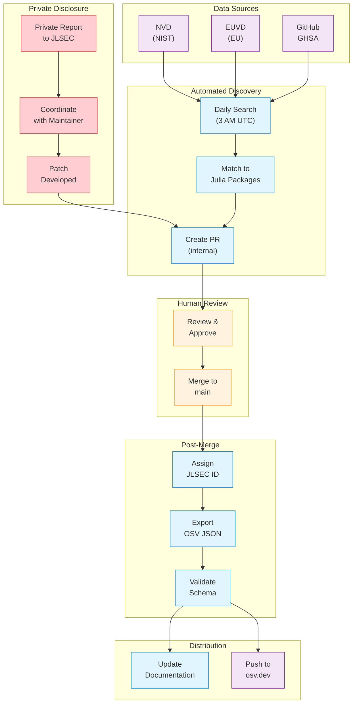
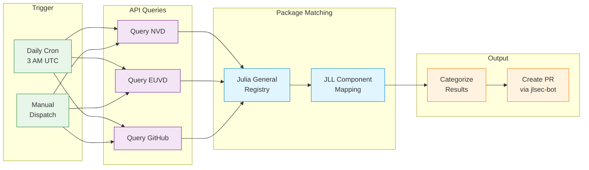
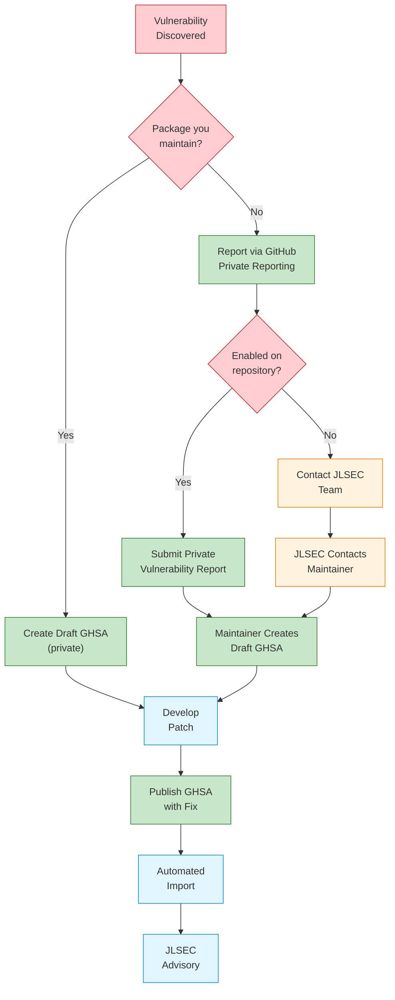
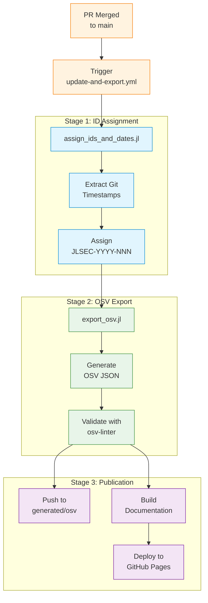
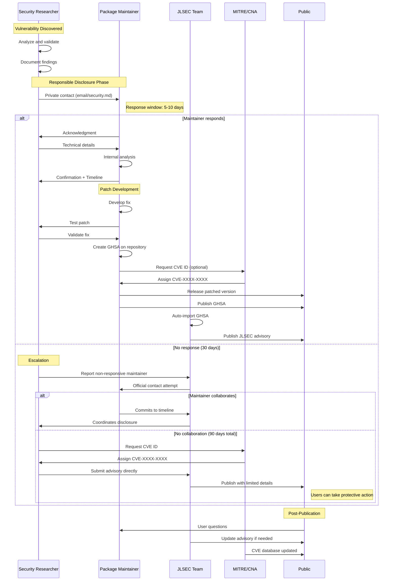
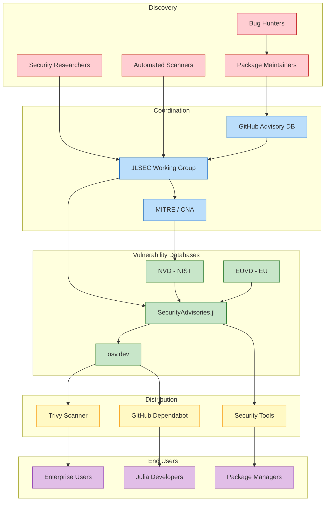
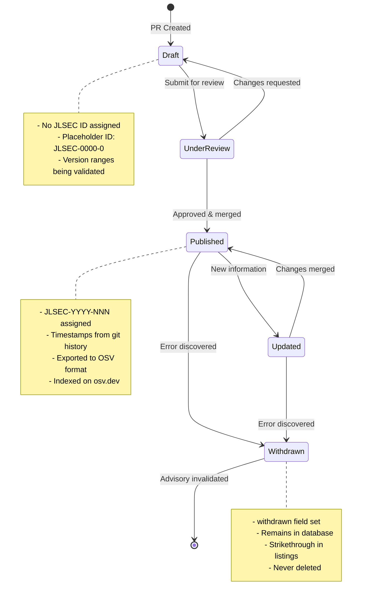

# Advisory Workflow

This page documents the complete workflow for security advisories in the Julia ecosystem, from initial discovery through publication and distribution.

## Overview

The Julia Security Advisory Database follows a multi-stage workflow to ensure accuracy, completeness, and timely publication of security information. The workflow involves both automated systems and human review to balance efficiency with quality.

```@raw html
<div class="diagram-legend">
    <div class="diagram-legend-item">
        <div class="legend-color legend-automated"></div>
        <span>Automated (GitHub Actions, scripts)</span>
    </div>
    <div class="diagram-legend-item">
        <div class="legend-color legend-manual"></div>
        <span>Manual (human review)</span>
    </div>
    <div class="diagram-legend-item">
        <div class="legend-color legend-external"></div>
        <span>External (NVD, EUVD, osv.dev)</span>
    </div>
    <div class="diagram-legend-item">
        <div class="legend-color legend-private"></div>
        <span>Private (confidential disclosure)</span>
    </div>
</div>
```

## Complete Advisory Lifecycle

The following diagram shows the end-to-end flow of a security advisory from discovery to distribution.



### Stage Descriptions

1. **Data Sources**: Vulnerabilities are discovered from multiple sources:
   - **NVD (NIST)**: National Vulnerability Database with structured CPE data
   - **EUVD (EU)**: European Union Vulnerability Database with faster updates
   - **GitHub GHSA**: Security advisories published on Julia package repositories

2. **Private Disclosure**: New vulnerabilities MUST be reported privately first:
   - Contact the JLSEC team or package maintainer through private channels
   - Coordinate disclosure timeline to allow patch development
   - Advisory is only created after a fix is available or disclosure deadline is reached

3. **Automated Discovery**: A daily scheduled job queries upstream databases and matches vulnerabilities against packages in the Julia General registry.

4. **Human Review**: All advisories require human review before publication to ensure accuracy of affected packages and version ranges.

5. **Post-Merge Processing**: After merge, automated systems assign unique JLSEC IDs, extract timestamps from git history, and export to OSV format.

6. **Distribution**: Advisories are published to this documentation site and the `generated/osv` branch for consumption by osv.dev and security scanning tools.

---

## Automated Discovery Process

The automated discovery system runs daily to find new vulnerabilities affecting Julia packages.



### How Discovery Works

1. **Trigger**: The workflow runs automatically every day at 3 AM UTC, or can be triggered manually for specific vulnerability IDs.

2. **API Queries**: The system queries three upstream databases:
   - **NVD API**: Searches for CVEs with Julia-related CPE entries
   - **EUVD API**: Searches for vulnerabilities by vendor/product
   - **GitHub API**: Queries for published GHSAs on Julia package repositories

3. **Package Matching**: Results are matched against the Julia General registry:
   - Native Julia packages are matched by name
   - JLL packages (binary wrappers) are matched via [GeneralMetadata.jl](https://github.com/JuliaPackaging/GeneralMetadata.jl) component tracking

4. **Output**: Matched advisories are categorized by data quality and a pull request is automatically created by jlsec-bot with detailed analysis.

---

## Reporting Vulnerabilities

!!! warning "Private Disclosure Required"
    **Never report vulnerabilities through public channels** (issues, public PRs, forums).
    This exposes users to attacks before a fix is available.



### Reporting Process

**GitHub Security Advisories (GHSA) is the preferred method** for all vulnerability reports. It provides:
- Private, secure communication
- Structured vulnerability information
- Built-in coordination tools
- Automatic CVE assignment capability
- Direct integration with JLSEC automated import

**If you maintain the affected package:**

1. **Create a draft GitHub Security Advisory** on your repository (this is private)
2. Develop and test a fix
3. Coordinate disclosure timing (typically with the fix release)
4. Publish the GHSA when the patched version is released
5. JLSEC will automatically import the advisory within 24 hours

**If you found a vulnerability in someone else's package:**

1. **Use GitHub's Private Vulnerability Reporting** (preferred):
   - Go to the repository's Security tab
   - Click "Report a vulnerability"
   - This creates a private report visible only to maintainers
   - See [GitHub docs](https://docs.github.com/en/code-security/security-advisories/guidance-on-reporting-and-writing-information-about-vulnerabilities/privately-reporting-a-security-vulnerability)

2. **If private reporting is not enabled**, contact the JLSEC team:
   - Email: security@julialang.org
   - The JLSEC team will coordinate with the maintainer

!!! tip "For Package Maintainers"
    Enable **Private Vulnerability Reporting** on your repository to receive
    security reports directly through GitHub. Go to Settings → Security →
    "Private vulnerability reporting" and enable it.

!!! note "No Public PRs for New Vulnerabilities"
    The SecurityAdvisories.jl repository only accepts PRs for advisories that have
    already been publicly disclosed elsewhere (CVE, GHSA, NVD). Never submit a PR
    containing details of an unfixed vulnerability.

---

## Post-Merge Processing

When an advisory PR is merged, automated systems handle ID assignment, validation, and publication.



### Processing Stages

**Stage 1: ID Assignment**
- `assign_ids_and_dates.jl` runs to assign unique identifiers
- **JLSEC ID Format**: `JLSEC-YYYY-NNN` where YYYY is the year and NNN is a sequential number
- **Timestamps**: `published` date is extracted from the first git commit, `modified` from the latest commit

**Stage 2: OSV Export**
- `export_osv.jl` converts all advisories to JSON following the [OSV schema](https://ossf.github.io/osv-schema/)
- The output is validated using `osv-linter` from the Open Source Security Foundation

**Stage 3: Publication**
- OSV JSON files are pushed to the `generated/osv` branch for osv.dev indexing
- This documentation site is rebuilt with the new advisory
- The site is deployed to GitHub Pages

The entire process is automated and typically completes within a few minutes of merging.

---

## Responsible Disclosure Timeline

The following sequence diagram shows the typical timeline for responsible vulnerability disclosure in the Julia ecosystem.



### Disclosure Guidelines

1. **Initial Contact** (Days 0-10): Contact the maintainer privately via email or the repository's security policy (SECURITY.md). Allow 5-10 days for acknowledgment.

2. **Coordination** (Days 10-30): Work with the maintainer to develop and test a fix. Agree on a coordinated disclosure timeline.

3. **Escalation** (Days 30+): If the maintainer is unresponsive, contact the JLSEC team for assistance in coordinating disclosure.

4. **Public Disclosure** (Day 90 max): Following standard responsible disclosure practices, vulnerabilities should be disclosed within 90 days, even if unpatched, to allow users to take protective action.

---

## Ecosystem Actors

The Julia security ecosystem involves multiple actors working together to discover, coordinate, and communicate vulnerabilities.



### Actor Roles

| Actor | Role | Responsibility |
|-------|------|----------------|
| **Security Researchers** | Discovery | Find and report vulnerabilities responsibly |
| **Package Maintainers** | Response | Fix vulnerabilities and publish GHSAs |
| **JLSEC Working Group** | Coordination | Curate advisories, coordinate disclosure |
| **MITRE/CNA** | Identification | Assign CVE identifiers |
| **GitHub Advisory DB** | Aggregation | Host repository-level advisories |
| **NVD/EUVD** | Enrichment | Provide structured vulnerability data |
| **osv.dev** | Distribution | Aggregate and distribute to scanners |
| **Trivy/Dependabot** | Alerting | Notify users of vulnerable dependencies |

---

## JLSEC Advisory Lifecycle

Each advisory in the JLSEC database goes through a defined lifecycle with distinct states.



### Lifecycle States

| State | Description | JLSEC ID | Visibility |
|-------|-------------|----------|------------|
| **Draft** | PR open, under development | `JLSEC-0000-0` (placeholder) | PR only |
| **Under Review** | PR submitted, awaiting approval | `JLSEC-0000-0` (placeholder) | PR only |
| **Published** | Merged to main, live | `JLSEC-YYYY-NNN` (assigned) | Public |
| **Updated** | Existing advisory modified | Same ID, new `modified` date | Public |
| **Withdrawn** | Published in error, invalidated | Same ID, `withdrawn` date set | Public (marked) |

### Key Principles

1. **Advisories are never deleted**: Even erroneous advisories remain in the database with the `withdrawn` field set, preserving the audit trail.

2. **IDs are permanent**: Once a JLSEC ID is assigned, it never changes, even if the advisory is withdrawn.

3. **Timestamps from git**: The `published` and `modified` dates are extracted from git commit history, ensuring accuracy and auditability.

4. **OSV compliance**: All published advisories are exported to OSV format and validated against the schema before distribution.
